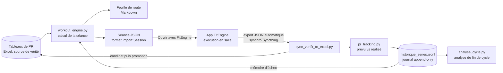

# FitEngine

Un système personnel de programmation de musculation en deux parties :

- **le moteur** (Python, dépôt `Coaching`) calcule chaque séance à partir de l'historique de records, avec un objectif simple : que chaque série proposée soit un record personnel atteignable, et aucune série « pour rien » ;
- **l'app** (Android, ce dépôt) sert à exécuter la séance en salle et à loguer ce qui a réellement été fait. C'est un fork de [verifit](https://github.com/MakisChristou/verifit), adapté à mon usage.

Les deux communiquent uniquement par fichiers JSON, ce qui permet de faire évoluer l'algorithme sans jamais reconstruire l'app.

## Le problème

Je m'entraîne en cherchant des records sur des nombres de répétitions précis (le meilleur poids à 3 reps, à 8 reps, à 12 reps...) et sur des maintiens isométriques (le meilleur poids tenu 15 s, 40 s...). Avant ce projet :

- l'historique vivait dans un classeur Excel d'une soixantaine d'onglets, un par exercice ;
- choisir les charges de chaque série demandait de croiser à la main records, fatigue et écarts entre séries ;
- le journal de séance était une app fermée (FitNotes), dont on ne pouvait pas faire évoluer le comportement.

Je voulais que la séance arrive toute calculée sur le téléphone, et que ce qui a été fait revienne tout seul dans l'historique pour calculer la suivante.

## Vue d'ensemble



La boucle est fermée : le plan généré sert de « prévu », l'export de l'app de « réalisé », et l'écart entre les deux nourrit la séance suivante.

## Le moteur

### Principes

- **Garantie « PR rentable ».** Toute série conservée propose une charge strictement supérieure au record historique sur le nombre de répétitions visé. Si aucune option ne le permet, la série est supprimée plutôt que remplie avec du volume inutile.
- **Deux familles d'exercices.** En répétitions, le « RM » est un nombre de reps ; en maintien (hold), c'est une durée en secondes. Le même algorithme s'applique aux deux, avec une seule convention de conversion (1 répétition équivaut à 3 secondes de maintien), d'où dérivent tous les seuils.

### Le calcul, étape par étape

1. **Capacité estimée.** Pour les répétitions, un e1RM (1RM estimé) est extrapolé depuis l'historique avec la courbe de Wathan : `W(RM) = e1RM × (48,8 + 53,8 × e^(−0,075 × RM)) / 100`. Pour les maintiens, la relation charge/durée est estimée par régression linéaire sur l'historique propre à l'exercice.
2. **Choix des cibles.** Les nombres de reps des trois séries ne sont pas fixes. Une recherche combinatoire, bornée par une fenêtre propre au mode de séance (Force : 1 à 10 reps ; Volume : 7 à 15), retient le triplet qui maximise d'abord le nombre de cibles jamais tentées, puis la marge de progression, en imposant un écart minimal entre séries.
3. **Ancrage de la première série.** S1 fixe la capacité du jour (`max(W(RM₁), record + 0,5 kg)`) et n'est jamais modifiée par les séries suivantes.
4. **Fatigue.** S2 et S3 sont dérivées de S1 avec des facteurs de fatigue intra-exercice (0,96 puis 0,93, plus un facteur supplémentaire quand S1 est très lourde).
5. **Écart minimal.** Deux séries consécutives sont séparées d'au moins `max(2,5 kg, 7,5 %)`, arrondi au demi-kilo inférieur.
6. **Pivot ou suppression.** Si une série plafonnée ne bat plus le record, le moteur cherche une cible plus haute dans la fenêtre, sinon il supprime la série.

### Ce qui a été ajouté à l'usage

- **Filet de sécurité.** Pour chaque série, le moteur calcule combien de reps on peut rater tout en restant au-dessus d'un record (ex. « filet 2 reps »). Depuis le 25/09/2026, la sélection favorise les cibles qui ont un filet. Cette décision s'appuie sur une simulation à partir de la variabilité réelle mesurée dans mon historique : de 9,8 à 11,3 records par exercice et par cycle, pour un coût d'environ 1 % sur le gain cumulé.
- **Mémoire d'échec.** Une série ratée n'est plus reproposée à l'identique : la charge suivante est plafonnée à un palier entre le record et la charge ratée.
- **Rejet d'une cible et remplacement d'exercice à la volée**, avec journalisation, quand une proposition ne convient pas en séance.
- **Séries hors plan** ajoutées à la main en séance : journalisées, et un échec y alimente aussi la mémoire d'échec.
- **Analyse de fin de cycle** (`analyse_cycle.py`) : taux de réussite par groupe avec intervalles de Wilson à 90 %, et une règle de preuve explicite (intervalles disjoints, au moins 20 tentatives par groupe) avant de conclure qu'un réglage marche mieux qu'un autre.

La spécification complète, avec son journal de décisions, est dans `RULES.md` (dépôt `Coaching`).

## L'app

Base : [MakisChristou/verifit](https://github.com/MakisChristou/verifit), une app Java/Android native, retenue parmi plusieurs alternatives open source (opengym, Flexify, Lotti, OpenScale, Fast N Fitness) parce que c'était la plus proche d'un journal de musculation type FitNotes. C'est un fork personnel, sans contribution prévue vers le dépôt d'origine.

Principaux ajouts :

- **Import de séance** : un fichier JSON généré par le moteur s'ouvre directement depuis Drive, un mail ou un gestionnaire de fichiers (« Ouvrir avec FitEngine »), avec un aperçu avant import. L'import est additif : il ne touche jamais à l'historique déjà logué.
- **Prévu et réalisé côte à côte** : chaque série importée garde son commentaire de plan (lecture seule) séparé de la note personnelle, et les écarts prévu/réalisé sont visibles.
- **Export pour le moteur** : un export JSON versionné (`schemaVersion`) écrit sous un nom fixe, synchronisé vers le PC, que le moteur lit sans aucune manipulation.
- **Sauvegarde JSON complète** en plus du CSV hérité.
- **Repos réellement pris** entre deux séries, calculé à partir des horodatages et inclus dans l'export.
- Historique des records par nombre de reps, badge de record, commentaires par série et par séance, calendrier avec filtres, supersets, minuteur de repos fiable téléphone verrouillé, chrono de séance, objectifs, statistiques par période, graphique par exercice, partage de séance.
- **Retraits** : le backend en ligne et la synchronisation WebDAV de l'app d'origine, inutiles pour un usage hors ligne.

## Choix d'architecture

### 1. Une seule source de calcul, plusieurs sorties

`compute_session_exercises()` est le seul endroit qui calcule une séance. La feuille de route Markdown, le JSON pour l'app et la comparaison prévu/réalisé consomment tous ce même résultat. Deux sorties ne peuvent donc pas diverger.

### 2. Intégrer par contrat de fichier

L'app et le moteur ne partagent que deux formats JSON documentés (`docs/session-import-format.md` pour l'import, `schemaVersion` pour l'export). L'exigence de départ était de ne pas devoir reconstruire l'app à chaque évolution de l'algorithme : elle a tenu. Les règles de calcul changent sans toucher au code Android ; l'app n'évolue que quand le contrat lui-même s'enrichit (par exemple le commentaire de plan stocké à part, ou le repère de cycle en commentaire de séance), et un champ inconnu de l'ancienne version est simplement ignoré.

### 3. Jamais d'écriture silencieuse sur la source de vérité

Une mise à jour de l'Excel passe toujours par un fichier candidat, relu depuis le disque et validé, puis promu, l'ancienne version partant en archive. Ce garde-fou vient d'un vrai bug : à la sauvegarde, la bibliothèque Excel effaçait les valeurs de colonnes calculées par formule, ce qui cassait le moteur en aval. Correctif : figer ces colonnes en valeurs avant écriture, et revalider le fichier réellement écrit.

### 4. Des journaux append-only comme mémoire

Les rejets, remplacements, échecs, séances annulées et l'historique série par série sont des fichiers JSON Lines en ajout seul, versionnés par git. Le classeur Excel, binaire, n'est pas versionné ; un changelog texte trace ses mises à jour pour que `git log` reste lisible.

### 5. Les noms comme seules clés, une seule table de correspondance

L'app n'a pas d'identifiant stable d'exercice : tout se fait par nom exact. C'est le point le plus fragile du système. Il est contenu dans une seule table de correspondance Excel ↔ app, utilisée dans les deux sens, et un exercice sans correspondance est ignoré avec un avertissement plutôt que deviné.

### 6. Préférer une question à un comportement silencieux

Une séance importée sans date atterrissait sur le jour affiché dans l'app, sans avertissement. Un import fait par erreur sur un jour vieux de deux semaines l'a révélé. Depuis, le moteur demande toujours la date et l'écrit dans le fichier. Même logique pour la source de données : le premier import passait par l'export CSV de FitNotes, qui perdait silencieusement 10,7 % des lignes (virgules non échappées dans les noms d'exercice) ; il a été remplacé par la lecture directe de la base SQLite.

### 7. Décider sur mesure, pas sur intuition

Les changements d'algorithme qui touchent la sélection (filet, mémoire d'échec) ont été précédés d'une mesure sur l'historique réel et d'une simulation, avec leurs limites écrites. L'analyse de fin de cycle formalise une règle de preuve pour éviter de conclure sur trois séances.

## Développé avec Claude

Ce projet a été construit en binôme avec Claude. Mon rôle : définir le besoin et les règles métier, trancher les choix d'architecture, relire, et tester sur le téléphone. Quelques pratiques qui ont rendu ce travail fiable :

- chaque dépôt a son `CLAUDE.md`, ses `decisions.md` et `architecture.md`, qui servent de mémoire entre les sessions ;
- Claude n'a pas de SDK Android : côté app, les changements se font par petites étapes testables une par une sur l'appareil, jamais par grosses suppressions invérifiables ;
- les tests valident des valeurs calculées indépendamment du code du moteur, pour pouvoir détecter une erreur dans la formule elle-même ;
- une revue d'architecture complète de l'app (28/09/2026) a produit une feuille de route par lots (sécurité des données, nettoyage, tests, fonctionnel, structure), traitée dans cet ordre.

## Qualité

- Moteur : 351 tests unitaires Python répartis en 8 suites, lancés d'un coup par `python generate_workout.py --test`.
- App : 21 classes de tests JUnit sur la logique isolée d'Android (records par nombre de reps, import et aperçu de séance, sauvegardes, export, temps de repos, rapport de partage...).

## Limites connues

- Réimporter deux fois le même fichier de séance duplique les séries (pas de clé d'idempotence).
- L'historique de l'app est stocké dans les `SharedPreferences` ; une persistance fichier ou base de données sera nécessaire si l'historique grossit beaucoup.
- Versions Android et dépendances anciennes héritées du dépôt d'origine (minSdk 16, targetSdk 31).
- Le moteur dépend d'un classeur Excel personnel et d'une table de correspondance tenue à la main ; pas de `requirements.txt` à ce jour (pandas, numpy, openpyxl).
- Outil conçu pour un seul utilisateur.

## Lancer

App : ouvrir le dépôt dans Android Studio, puis `Run` (Gradle, AGP 7.4).

Moteur (dépôt `Coaching`) :

```
python generate_workout.py            génère la séance (Markdown + JSON pour l'app)
python sync_verifit_to_excel.py       met à jour les records depuis l'export de l'app
python analyse_cycle.py               analyse de fin de cycle
python generate_workout.py --test     lance toutes les suites de tests
```

## Crédits et licence

Fork de [verifit](https://github.com/MakisChristou/verifit) (MakisChristou), sous licence GPL-3.0, conservée pour ce fork. Bibliothèques : [MPAndroidChart](https://github.com/PhilJay/MPAndroidChart), [Gson](https://github.com/google/gson).
